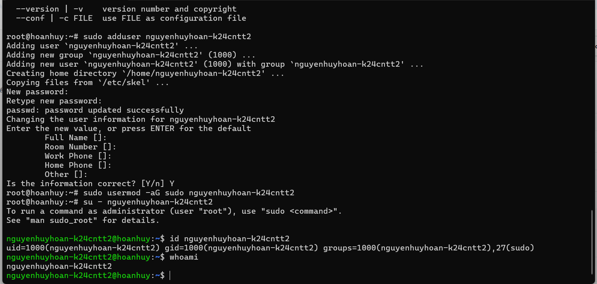
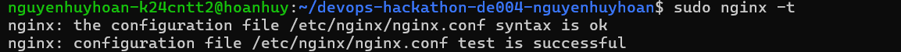
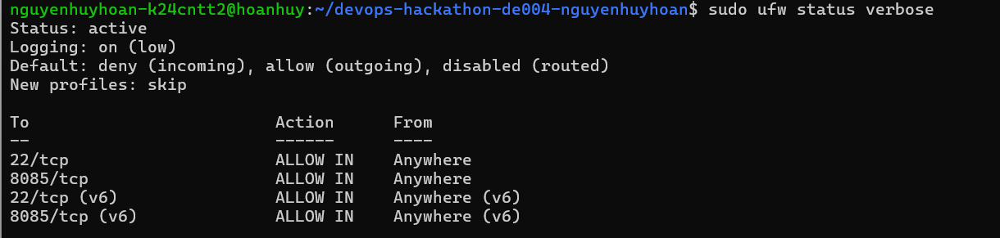
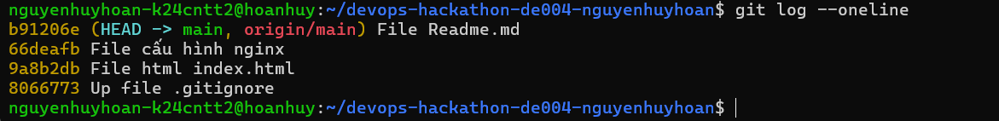

#DevOps Hackathon - Đề 004 : Quản lý kho hàng ( Inventory )

##1. Thông tin sinh viên :
Họ và tên : Nguyễn Huy Hoàn
Mã sinh viên : PTIT-HN-149
Lớp : KS24-HN-CNTT2
Tài khoản linux : nguyenhuyhoan-k24cntt2
Github : https://github.com/Hoan06
Cổng nginx : 8085

##2. Môi trường triển khai :
Hệ điều hành : Linux
Phiên bản nginx : 1.18.0 ubuntu
Git : 2.34.1 
Nơi chạy : VPS

##3. Cấu trúc dự án :
devops-hackathon-de004-nguyenhuyhoan
	src
	nginx
	screenshots

##4. Cấu hình nginx : 

Cổng : 8085
Root : devops-hackathon-de004-nguyenhuyhoan

##5. Tường lửa :
Cấu hình tường lửa cho phép 22/tcp và 8085/tcp 

##6. Các bước triển khai : 
Tạo user -> đổi mk user -> cấp quyền user -> tạo config git -> cài đặt các gói pakages nginx git -> tạo file thư 
mục làm bài -> cấu hình những file cần thiết ( sudo nano ) -> đẩy lên git -> clone git về -> phân quyền vào thư mục var -> cấp quyền -> copy var sang etc nginx -> sudo ln -s 
sang enabled -> chạy nginx -t và reload nginx -> cho phép tường lửa 22/tcp và 8085/tcp -> đẩy git đầy đủ các minh chứng

##7. Ảnh minh chứng : 

